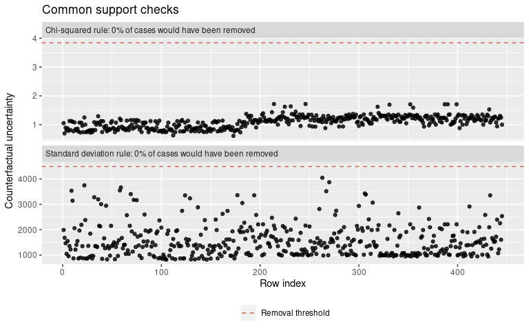
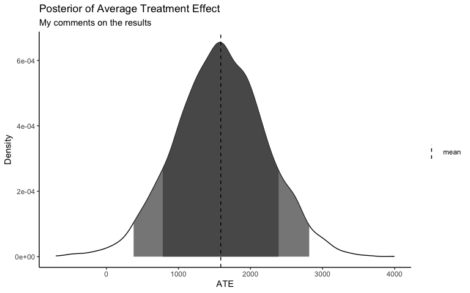

<!-- README.md is generated from README.Rmd. Please edit that file -->

# plotBart

<!-- badges: start -->

[](/LICENSE.md)
[](https://www.tidyverse.org/lifecycle/#experimental)
[](https://github.com/joemarlo/plotBart/actions)
[](https://github.com/joemarlo/plotBart/commits/master)
<!-- badges: end -->

plotBart is a diagnostic and plotting package for
[bartCause](https://github.com/vdorie/bartCause) and
[thinkCausal](https://github.com/gperrett/thinkCausal_dev).

``` r
library(plotBart)
data(lalonde)
confounders <- c('age', 'educ', 'black', 'hisp', 'married', 'nodegr')

# fit BART model
model_results <- bartCause::bartc(
  response = lalonde[['re78']],
  treatment = lalonde[['treat']],
  confounders = as.matrix(lalonde[, confounders]),
  estimand = 'ate',
  commonSup.rule = 'none',
  verbose = FALSE,
  keepTrees = TRUE
)

# plot common support
plot_common_support(.model = model_results)
```



``` r
# plot CATE and manipulate ggplot object
plot_CATE(
  .model = model_results, 
  type = 'density', 
  ci_80 = TRUE, 
  ci_95 = TRUE,
  .mean = TRUE
) + 
  labs(subtitle = 'My comments on the results') +
  theme_classic()
```



## Installation

plotBart is currently in development and is available to test by
installing via:

``` r
# install.packages("remotes")
remotes::install_github("joemarlo/plotBart")
```

### Test coverage

    #> plotBart Coverage: 90.58%
    #> R/plot_waterfall.R: 85.11%
    #> R/plot_ATE.R: 86.71%
    #> R/utils.R: 86.96%
    #> R/plot_overlap_pScores.R: 90.91%
    #> R/plot_overlap_vars.R: 92.86%
    #> R/plot_moderators.R: 92.97%
    #> R/plot_balance.R: 96.00%
    #> R/plot_common_support.R: 97.22%
    #> R/plot_trace.R: 100.00%
